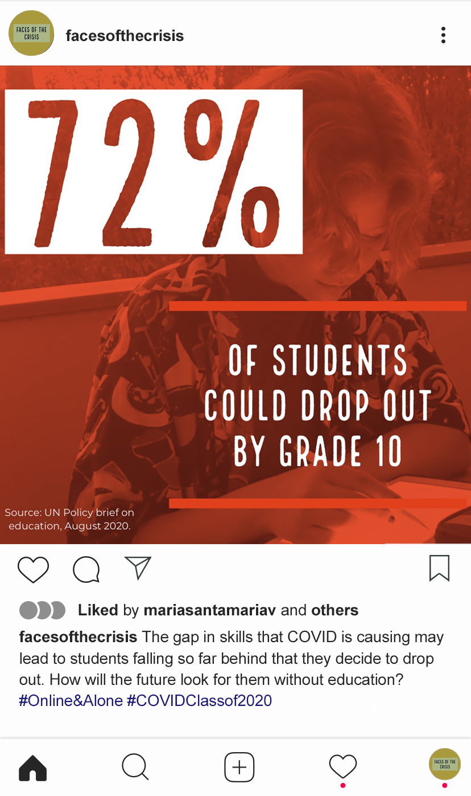

Along with two of my classmates of the Digital Journalism Master at HMKW, we dig deep into the consequences and the impact the COVID crisis has on education in Berlin. We named our project 'Faces of the Crisis'. 

We interviewed teachers, language teachers, social workers, and students. We research data and studies to provide a wide landscape of the consequences of the interaction between a sanitary crisis and the academic sector. As a result of our research, we wrote a feature, produced a video, and did the social media strategy to promote our project to the public. 

We all contributed to the different parts of the project, but I was mainly in charge of the social media strategy. I wanted to use distinctive typography and a palette of colors to help create a brand identity for 'Faces of the Crisis.' I also generated different types of content for Instagram, aiming to engage the audience, provide them with important information and raise attention towards our different products as the results of the project as a whole. I also created two hashtags for identifying and summarizing the gist of our project: #Online&Alone and #CovidClassof2020

For privacy reasons, the whole project cannot be shown, but here are some of the pieces I created: 

