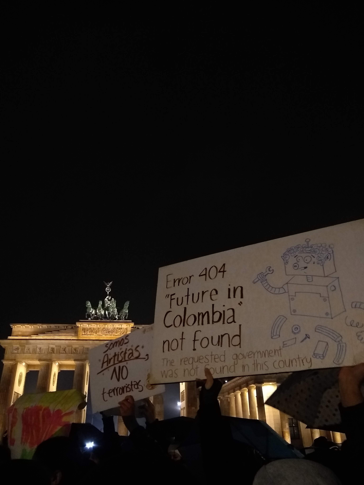

*How have fellow citizens in the distant Berlin respond to protests in South America.* 

It is a cold December Friday night but the streets of Mehringdamm sizzle with music and the clinging of bottles. Against the lively background, a group of 21 concerned looking strangers gather, discussing how they should continue the support to Colombia’s national strike which started on November 21st. One of the strangers stands up and asks, “*what is our role here?*” The discussion gets heated, it is hard to put in words the emotions that bring these people together in an otherwise Berlin party night. 

During the second semester of 2019, almost every country in Latin America witnessed citizens taking the streets for protesting against unrepresentative governments and failed state systems. Each time, thousands of miles away here in Berlin, their expats did the same. Beyond a natural sense of solidarity, for protesters in Europe life here has given them new perspectives and invigorating reasons for demonstrate. 

Crowds rallying in the streets of Mitte has a clear origin for Alberto Baltazar, doctoral candidate in Social and Cultural Anthropology of the Freie Universität Berlin and expert on migration dynamics: “*History has demonstrated that pacific protests in Europe lead to real changes whilst in America the impact of a demonstration is close to zero, since impunity and corruption is bigger and power networks are stronger and immovable*.” 

History plays an important role also for a member of the collective ‘Democracia para Bolivia desde Alemania’ (Democracy for Bolivia from Germany) that prefers to remain anonymous: “*It is a huge coincidence that the same week that Evo Morales left was the week of the fall of the Berlin wall. That’s the power of history. Democracy has come out victorious*” - he refers to the removal of Morales as president last October, preceded by protests against a widely controverted and allegedly fraud re-election of the former president for the 4th time in a row. 

When protests broke in La Paz, Cochabamba and other cities, the collective organized via social media and was able to reunite some 200 expats only in Berlin for a first demonstration, and many more in other seven German cities. “*All of us that live in Europe have learned to live in a real democracy and this is what we seek for our Bolivia, our brothers, parents and friends*”, he reflects. 

On a different cold night, a child claps his hands and dances in a window to the rhythm of the protests chants of 500 persons that walk with banners, instruments and Colombian flags under an intense rain towards the Brandenburg Gate. “*There are lots of people here that have very precarious conditions as migrants*” says Alexandra, member of the ‘Kolumbienkampagne Berlin’ (Colombian Campaign Berlin), one of the collectives that organized the protests after the start of the national strike, “*this is a way for proving that we, here, don’t have solidarity only for what happens in Colombia but also what happens with Colombians here in Europe*”. 

Jheysson is member of ‘Unidos por la paz – Alemania’ (United for Peace – Germany) another collective organizing the protests, and one of the protesters himself. He yearns of coming back to his homeland but in different conditions: “*I wish Colombia has a society in peace like the one here. I see here that life is very important: yesterday there was a shooting and today there are demonstrations already*” - He refers to the recent attack to two shisha bars in Hanau, in which the shooter killed nine people - “*That means that a single life is appreciated and valued. In Colombia everyday someone is getting killed and we don’t care. I want my country to achieve that standard of life respect*”. 

Baltazar brings a different input on this point: “*European countries have the media reflectors pointed their way. Is not the same what happens in a neighbourhood in Mexico to what happens to one in Berlin*”, Alexandra thinks the same about the impact of media here: “*Believe it or not, if you spread information and it reaches European press, the Colombian government resents it because it doesn’t like being in international press with a bad image*” 

Baltazar does agree with the different life respect standards, particularly in the context of protesting: “*In Europe the government gives you the possibility of reuniting and demonstrating, meanwhile, in many Latin American countries that’s unthinkable because once you do, the government is already chasing you*” 

On this regard, the Chilean case has been one of the most violent in the recent record of protests. Police brutality has injured many demonstrators and left thousands without eyes. Francisco is part of ‘Frente Amplio Chile’ (Broad Front Chile), an activist collective organizing demonstrations in support here in Berlin and other places in Europe. 

For him, European life works as an eye opener against a government that is blinding their citizens: “*People come here and realize the immense amount of fake tales they sell us in Chile. They realize that the socio-economical structure that functions there is not normal”* in this way, Europe brings new perspective of state and life models *– “you arrive here and realize that there is a capitalistic normality that is different and possible*” 

In yet another cold night, opposite of the Brandenburg gate, a German police officer approaches a group of protesters and talks to a smaller group that holds the megaphone. “*Comrades, is time we finish the protest, the police say we have five more minutes*” says Jheysson. People uses the remaining time for some last cheering accompanied by the sound of hundreds of pans and pot lids being hit. They hope the sound will reach their home land. 

A new meeting day is settled, as long as the national strike remains alive, the support will too. For the Bolivian representative, their chant of “*Who surrenders? Nobody surrenders. Who gets tired? No one gets tired*” has become a personal motto. Chilean expats have now settled an international council with which they hope to help wining the referendum for a new Constitution. 

There is a popular Colombian saying that goes “*comer mierda*”, which translated literally means ‘eating shit’ and it refers to going through hard situations. Solidarity, the new perspectives that European life brings and the possibilities it gives to expats for demonstrating, all of the reasons behind the protests in support, are perfectly summed up by Jheysson: “*You know? If we eat shit, we eat it together*”