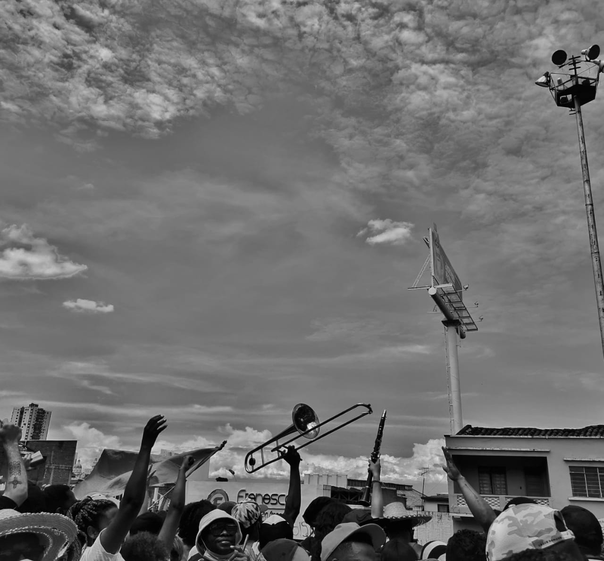
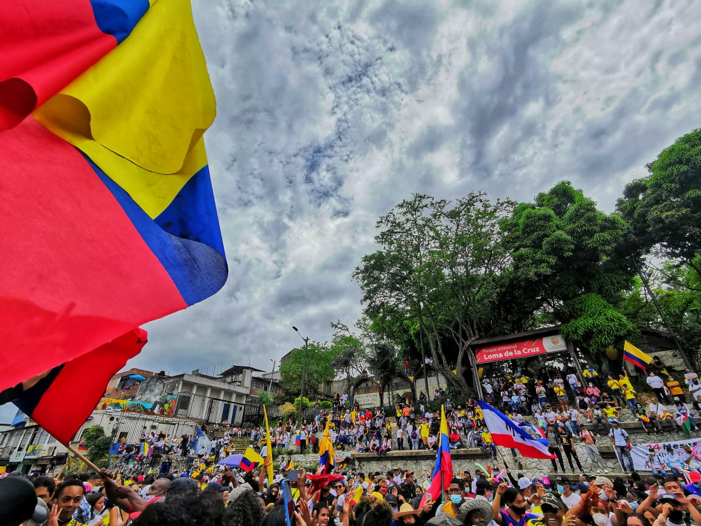

You can read [here](https://luxiders.com/colombia-revolution-and-brutality-broadcasted/) the text published in Luxiders Magazine on May 10th, 2021. 

*Colombians are being murdered by police forces while exercising their right to demonstrate, and social media is showing it to the world.*

Protesters have been filling the streets of Colombia since April 28. The ongoing national strike started against the tax reform proposed by President Iván Duque's government, which was later momentarily retired, but also for denouncing the constant massacre of social leaders and human rights defenders, the handling of the COVID-19 crisis, and overall discontent with the administration.

To demonstrations including chants, dances, performances, music, and even voguing, the government replies with violence from the police, particularly its anti-riot force, better known as ESMAD. NGO Temblores reported 1.728 cases of police violence until May 6, including 37 killings and 11 sexual aggressions. Official numbers are difficult to gather given the dimensions of the situation.

The dramatic human rights breach that protesters are going through is being recorded, and social media is having a pivotal role in spreading it to millions around the world. Independent and internet-based media outlets like La Oreja Roja, Primera Línea, and Vorágine continuously post citizen videos of police brutality. Celebrities, like Colombian singer Adriana Lucía, actors Julián Román and Santiago Alarcón, and even Puerto Rican singer Residente, have either started or joined live videos from protesters within the manifestations, sharing the clashes with police forces with their millions of followers.

Social media visibility is especially vital when official media does not give air space to the attacks against protesters. They even alter information, which is the case of RCN news, one of the biggest of the country. The channel shared a video of a protest in Cali using the headline "Celebration for changes in the reform," falsely referring to the manifestations as supporting modifications Duque announced for the reform at that moment. NGO Human Rights International tweeted about the situation asking RCN not to lie, a basic journalistic principle.

On the internet, the strike has other expressions. The hacker group Anonymous deactivated the website of the Colombian Army, and the comment section of the United Nations YouTube Livestream is flooded with hundreds of messages saying "SOS Colombia". An NYU webinar on May 5 with ex-president Uribe, the political godfather of president Duque, turned into a disaster since the internet connection of both the event's hosts and Uribe was continuously interrupted, all the while he kept complaining of technical difficulties. Like happened with racist hashtags in the United States, the K-pop fandom hacked hashtags used by supporters of the police forces by virally tweeting them with videos of K-pop concerts and songs.

Increasingly since May 5, users report censorship by Instagram. Many accounts actively sharing strike-related content have been banned from transmitting or posting, on the grounds that their content goes against community guidelines, but the warning shows even if what they are trying to share does not depict violent scenes; or in other cases, all the content they upload related to the strike is taken down. Even celebrities like actresses Rachel Zegler and Jameela Jamil reported on Twitter that Instagram took down their stories about Colombia without explanation. Users also noted that the IG stories of those sharing about the strike are not visible.

Furthermore, British internet monitoring company Netblocks revealed interruptions in the internet service in Cali, one of the cities where the demonstrations have been more numerous, and the violence has been equally cruder, with police shooting civilians in working-class neighborhood Siloé. The government attributed the failure to damage caused by vandals on underground infrastructure.

This phenomenon aligns with the proposition of journalist Paola Ochoa of Blu Radio. She said on air that maybe the government should limit the access to the internet in the country since most of the protests were convened via social media, blatantly inviting the administration to restrict the fundamental right of free expression.

Colombia's history with police brutality is not new. Only last September, protests erupted after a video of lawyer Javier Ordóñez being tased by two police officers while begging "please, no more", was shared through social media. Ordóñez was then tortured in a police station and later died. The following night, during protests that reminisced those after the killing of George Floyd in the U.S., 13 people were murdered by the police.

The New York Times, DW, and BBC are sharing news about Colombia, and British media The Guardian opened a Whatsapp line through which people can report police brutality. Celebrities like Kali Uchis, Kim Kardashian, Viola Davis, Karol G, and Don Omar share content on their social media about the situation in the country.

While Colombians keep taking the streets with the pulsing threat of a police force that is supposed to defend them but kills them instead, videos spread virally, overcoming internet interruptions and censorship. Regardless of how the strike ends, the world will remember the horror nights the Colombian government is putting their citizens through because millions of social media users are now witnesses, and the internet does not forget.