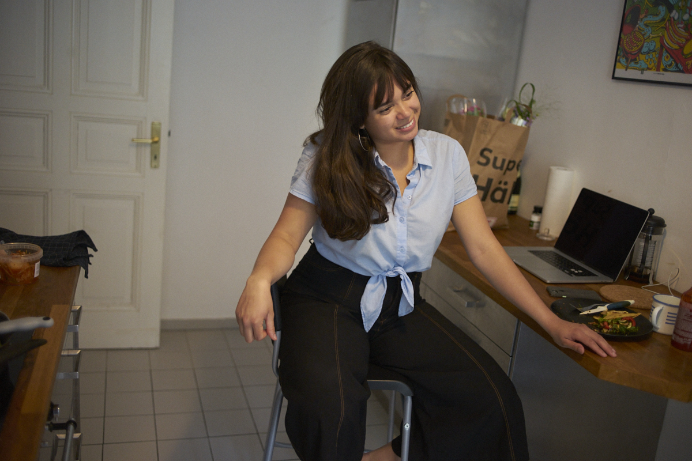
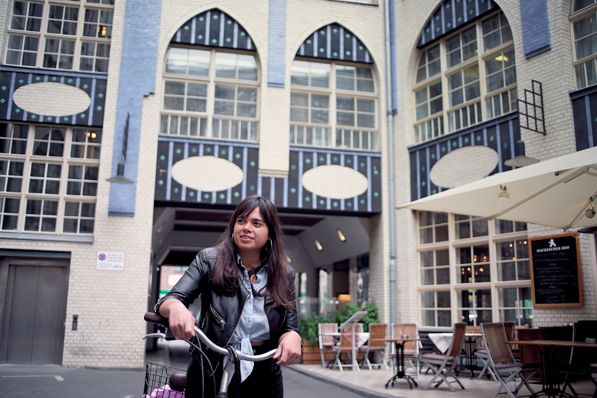

*Originally published [here](https://www.trampolin-mag.com/bruna-silva/) on June 2020.* 

Existe un extraño fenómeno al migrar que hace que te sientas más cercano y representado por el lugar que dejaste atrás una vez estás lejos. Bruna Silva (Río de Janeiro, 1987) lo siente palpitar en ella. Dejó su ciudad natal hace siete años y ahora llama a Berlín su hogar: “*Desde que vine a Europa me di cuenta que me siento más latina y pienso más sobre ello*”. Tal vez esta latinidad que nos une, como un lazo invisible de nacimiento, es lo que hace que, a tan solo una hora de conocernos, nos riamos con la comodidad de las viejas amigas.

Su risa es amable y alrededor de ella se siente la buena vibra. “*Soy brasileña y por eso mismo soy relajada*”, resume, sin ironía y con gusto. En este buen ambiente tenemos conversaciones que pasan por sexo, relaciones, terapia psicológica y problemas de ansiedad, y  Bruna reconstruye la historia que la llevó a fundar hace casi cuatro años el grupo de Facebook 'Expat Ladies in Berlin'*,* el cual, a hoy, reúne cerca de 19 mil mujeres de lugares tan distantes y diferentes como Colombia, Polonia, Túnez, Argentina, Serbia o Turquía.

En Facebook se pueden encontrar muchos grupos como este, algunos enfocados hacia nacionalidades en específico y variados de acuerdo al país o la ciudad. Pero la comunidad que se ha formado en 'Expat Ladies in Berlin' se siente solidaria y sorora y sus acciones sobrepasan el espacio de la virtualidad. El *inbox* de Bruna recibe mensajes agradeciéndole por haber creado el grupo, y con esto, cambiarle la vida a varias mujeres.

Un paso rápido por los últimos posts sirve para ver lo que lo hace tan especial para las que pertenecemos a él. Una mujer del sur de Europa expresa su preocupación al ver que los hombres con los que ha salido en citas en Berlín no pagan su parte también, como invitación, y el post ha generado un debate que reúne 910 comentarios en las primeras veinte horas de publicación.

Otra mujer denuncia un grupo en Facebook que está divulgando pornografía infantil e invita a las usuarias a ayudarla. En menos de siete horas, el post tiene 164 reacciones y casi 90 comentarios. Una mujer que prefiere mantenerse anónima comparte los problemas que vive por la adicción de su novio a las drogas; el post reúne más de 50 comentarios que incluyen 'TED Talks' sobre adicción y consejos de mujeres que han trabajado con personas adictas. Finalmente, una mujer hace una actualización a su post original, agradeciendo por la cantidad desbordante e inesperada de respuestas a su deseo de conocer mujeres para salir a caminar y compartir.

“*Lo que me pasa con ser latina es lo mismo que pasa con el feminismo. Desde que me involucré, comencé a ver las cosas con otros ojos*.” Un blog feminista llamado, en el portugués original, “Escreva, Lola, Escreva” (“Escribe, Lola, escribe”) e inspirado en la película *Run Lola Run* que toma por locación a Berlín, fue la primera conexión de Bruna con el feminismo. De vuelta a 2007, cuando Facebook daba sus primeros pasos, los posts de este blog entraron en su *feed*. Bruna caminaba todos los días desde su universidad al lugar de sus prácticas y nunca faltaban los comentarios indeseados y vulgares. “*Latinoamérica es muy macho*”, concluye. Llegar a la práctica y leer un artículo del blog se convirtió en su catarsis.

Terminó la universidad, una relación y estaba lista para dejar Río. “*Fui criada para irme fuera del país. Mi mamá siempre me decía que me fuera de Río.*” Estudiar en un colegio alemán le dio el idioma, y tener la oportunidad de visitar Europa en varias ocasiones, una perspectiva de dónde quería vivir. Berlín siempre tuvo un lugar en sus anhelos y fue el lugar a donde vino a cumplir el deseo que su mamá le impulsó.

Ahora, siete años después, trabaja como diseñadora visual en la agencia AJ&Smart y vive con su novio, con quien tiene una relación desde hace cinco años. “*Somos un raro caso de éxito de OKCupid. Cuando lo conocí, llevaba año y medio en Berlín y había salido en muchas citas. Me hacía falta alguien con un buen sentido del humor como él*.”

Berlín llenó sus expectativas y continúa haciéndolo, en particular cuando se podía ir a KitKat, uno de los clubes nocturnos más famosos de la ciudad, con *dress code* fetichista, música techno y la posibilidad de tener sexo sin pudores. KitKat es el club favorito de Bruna. “*La libertad que sientes ahí es increíble. Como latina, siento que es la misma sensación de caminar aquí por un callejón oscuro sabiendo que nada malo va a pasar, es MUY liberador.*”

Pero al llegar, Berlín fue en cierta medida tan “macho” como Latinoamérica. En grupos destinados a encontrar apartamentos, vender cosas como entradas a conciertos o ropa de segunda; o inclusive grupos que buscaban ser puntos de reunión para *expats* como ella, no encontró un espacio en el cual sentirse segura y bienvenida. Por tanto, decidió crearlo.

“*Soy una procrastinadora y Facebook es muy sencillo y cuesta poco trabajo. Dos clicks y el grupo había comenzado*”, recuerda de vuelta a agosto de 2016. Bruna no sabía lo que iba a suceder con el grupo ni el crecimiento que iba a tener, solo su intención era evidente: ayudar a otras mujeres a tener un espacio seguro, y de paso, ser ayudada a tener lo mismo para ella. 'Expat Ladies in Berlin' creció orgánicamente, mostrando que muchas mujeres sentían el mismo vacío que ella. Al comenzar envío el *link* contándole de su iniciativa a sus amigas, les habló a unas cuantas mujeres que había contactado en otros grupos de Facebook y así comenzaron todas a llegar y confluir, hasta conformarse en la comunidad que son hoy por hoy.

El término *expat* en inglés es más controversial que el castellano “expatriado”. Para algunos, refiere a una situación de migración de privilegio y usarlo es hacer explícita una diferencia. Bruna explica que eligió el nombre por el grupo virtual 'Berlin Expats', que ya contaba con popularidad y visibilidad en Facebook, cosas que su nuevo grupo necesitaba. “*Ahora que la comunidad está conformada, renombrarla podría ser confuso. De igual modo, la parte más importante del grupo no es el nombre sino los contenidos*”, concluye.

Administrar 'Expat Ladies' es parte de su rutina. Por su trabajo pasa muchas horas frente al computador y cada dos o tres horas, invierte diez minutos a revisar comentarios y solicitudes. “*Es un trabajo, por encima de todo, emocional y que demanda mucha energía*”.

Se detiene para poner un recordatorio en su celular y no olvidar que tiene cita con su terapeuta, que está de vuelta en Río. Tiene citas constantes, desde hace años, para hablar de su salud mental. Hoy en día hablan sobre un pensamiento recurrente: su vida está en un punto tan estable que se acerca a lo aburrido. Estar tan cerca a lo lineal la hace extrañar el drama: “*Tal vez por eso procrastino tanto, para poner algo de dolor u otro sentimiento diferente a lo cotidiano en mi vida*”.

Así como la ha hecho feliz cuando alguien le dice que 'Expat Ladies' ha cambiado su vida, algunas veces, el grupo va en contra de su salud mental. Al fundarlo escribió una serie de reglas, de las cuales solo recuerda la primera y más importante: “sé empática, sé amable”. A veces las mujeres se llaman “perras” u otros insultos y Bruna es contundente: elimina los comentarios y a la usuaria del grupo. La participación en 'Expat Ladies' está limitada por la capacidad de cada mujer de mantenerse solidaria y sorora, los valores de la comunidad.

“*Una vez eliminé un comentario, eliminé a la chica del grupo y la bloqueé de mi cuenta personal, porque sabía que iba a venir detrás de mí*.” Tenía razón, fueron las amigas de esa chica quienes le escribieron reclamándole por no ser objetiva. “*Soy un ser humano* —dice Bruna—, *por supuesto que tengo sesgos, porque tengo pensamientos y emociones, es inevitable.*” Si llega alguna interacción hostil, respira profundo y cuenta hasta cinco antes de tomar una decisión: la buena onda del grupo debe venir en primer lugar, como siempre lo ha hecho, desde ella.

“*En dos ocasiones organicé encuentros de mujeres latinoamericanas, les pedí que trajeran comida de sus países de origen y fueron encuentros muy bonitos. Creo que debería volver a hacerlo*.” La virtualidad se ha trasladado a la realidad en esas situaciones y en otros grupos que han originado de este. Hay participantes que se han organizado a través de otras redes como Whatsapp para establecer grupos de acompañamiento a ver apartamentos, de chicas que viven en cierto barrio y desean tener amigas en el vecindario, o inclusive de chicas que necesitan compañía presencial y psicológica para realizarse un aborto.

“¿Crees que existen este tipo de comunidades exclusivamente para hombres?”, le pregunto. “*En el mundo off-line hay muchos espacios reservados exclusivamente para los hombres y temo que, si existen espacios como este en la virtualidad, sean usados para hablar en contra de las mujeres. Los hombres blancos y heterosexuales no necesitan este tipo de espacios para estar seguros, internet brinda un lugar para las minorías. Creo que el feminismo se hace más fuerte en este tipo de espacios virtuales en donde las mujeres logran hacer conexiones*”, me responde con claridad.

«¿”Expat Ladies” tiene una tendencia feminista?» Medita por unos momentos antes de responderme: “*Quisiera decir que sí, pero no lo puedo decir con totalidad. Espero que este grupo sea una manera para que las mujeres puedan conocer de feminismo y de otras de sus corrientes*”.

Cuando se hartó de su realidad en Brasil, Bruna tomó una decisión radical para cambiarla por una realidad que amara. Así está ahora en Berlín, ama su vida a pesar de que extraña estar entre su misma gente y poder utilizar ciertas expresiones y modos de hablar que sabe que acá son considerados “muy atrevidos”. Al migrar, construyó la realidad en la que quería habitar. Ahora visita Brasil al menos una vez al año y se queda un mes. Tiene el privilegio de poder visitarla como una turista nativa y poder gastar en euros allá. Es claro que si tiene hijos, poder ir a Brasil y estar en contacto con la cultura, será esencial.

Y esta construcción se hizo despacio, inspirándose en una familia que la apoyaba, reflexionando sobre lo que le faltaba en Brasil y lo que encontró en Alemania: un espacio que motiva a las personas a ser lo que quieran. El lugar seguro que le faltaba al comienzo lo creó en la virtualidad y ahora este espacio cobija a muchas mujeres más. Una acción que parece insulsa u ordinaria, pero que para las mujeres de esta comunidad, ha sido transformadora.

Nuestra conversación se acerca a su fin. Luego de reírnos de los tropiezos comunes como mujeres latinas y migrantes, le digo: “¿Podrías resumirme lo que es el grupo para ti y lo que significa?”, no se me ocurre quién lo puede hacer mejor. Se toma un momento, no sabe muy bien cómo responder. “*Mi definición del grupo es: gente ayudándose entre sí*.”