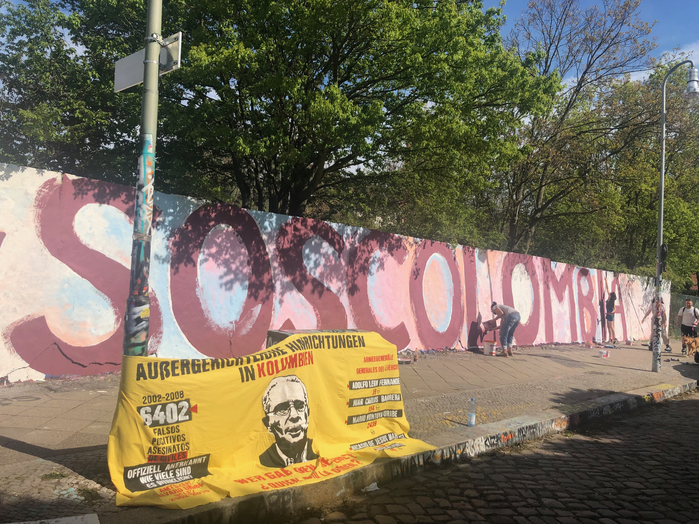
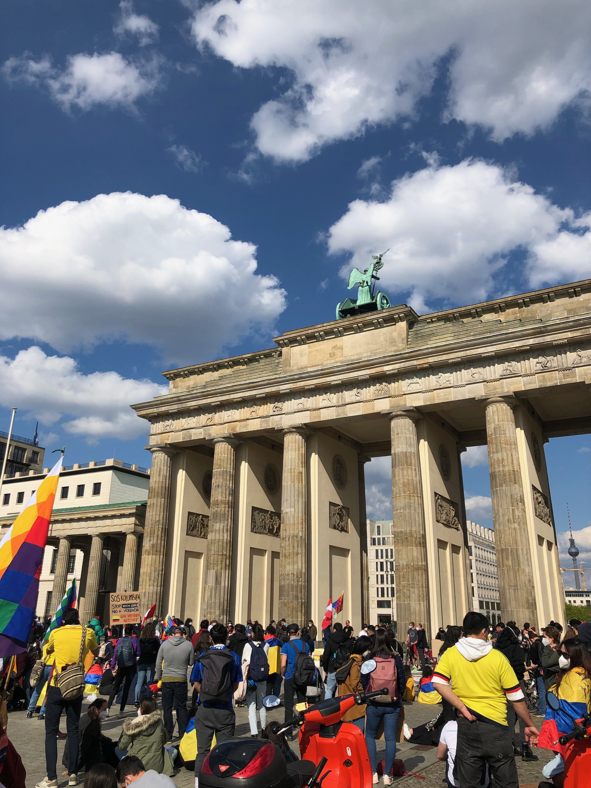
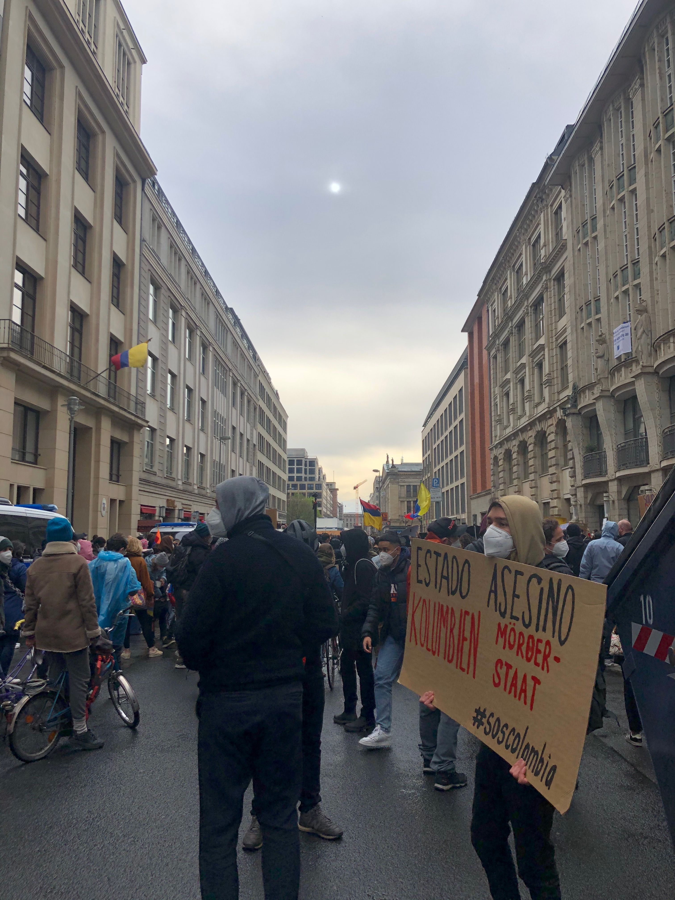

*This is the original interview we did. You can see [here](https://dieverpeilte.de/proteste-kolumbien/) the published version in German, published in Dieverpeilte on May 14th, 2021. All the pictures are taken by me.* 

**What exactly is happening in Colombia right now?**

Long story short: Colombians have been filling the country's streets every day since April 28, in mostly peaceful demonstrations, and the government has replied with brutal police repression. The protests started against a tax reform proposed by President Iván Duque's administration, which after five days of protest, was retired to make modifications, but now continue for various reasons. Some are more evident: a health reform that right-wing parties are impulsing in Congress. Some come from before: the constant murder of right defenders and social leaders since the installment of this administration, the poor management of the pandemic and the vaccination against COVID-19, the lack of implementation of the peace agreements with former FARC guerrilla, and overall discontent from citizens.

Because of the dimensions of police brutality, I feel that what started as citizens exercising their lawful right of protesting has become a crisis of human rights. All the while, citizens are still on the street to show the government their discontent and reclaim that protests must be guaranteed as legitimate. The numbers are chilling. NGO Temblores reports up until 11 p.m. of May 10 that 40 people have been murdered, allegedly by police forces, and 12 have been victims of sexual violence, among other crimes included in the total 1956 cases of police violence. Another chilling number is the missing persons count that until May 12 adds up to 168 persons. These numbers surpass, in fewer days, what happened in Chile in the second semester of 2019 or what happened last year in the US after George Floyd's murder. It is challenging to know the figures with certainty, given that the situation is still ongoing, with new numbers adding every day. 

Police brutality has surpassed repression. Many videos show police scattering entirely peaceful manifestations like vigils; or shooting tear gas or shots into residential units, neighborhoods, or people who weren't even being part of the protests. The crimes committed by police forces are many, and at the same time, there have been violent incidents within protestors, which have been caught being police infiltrates on some occasions. Violence is present and simmering. 

Another thing that the strike has shown is the racism and classism within Colombian society. The indigenous Minga, a collectivity of diverse indigenous communities, went to Cali to support the citizenship there since the city has been the focus of violent repression and killings by the police. On Sunday, May 9, citizens wearing white shirts and driving high-end SUVs started shooting against members of the Minga while Police stood idle by them as multiple videos show and injured 9 of the Minga members. After the crime, Duque called the Minga to "go back to their territories", and the director of the Foundation of Cali's Zoo called them "indios", a derogative term, and told them to "get out of their territory". I think besides the evident brutal and horrible police brutality, this is showing a type of dissonance that Colombians from the highest social spheres (in terms of richness) have with other citizens, disregarding that we all come from indigenous people and that the whole territory is also theirs despite historical and systematical segregation. And also, this is getting to the extreme in which citizens are now arming themselves and going out to kill other Colombians. Impulsed by the government, citizens are fighting a war against each other that does not exist because they are not declared enemies, or at least they shouldn't be. 

It is also important to point out that traditional media is giving false and biased information to the audience, and that social media has a key role in giving a platform to independent and emergent media. The strike is having repercussions in many different instances. 

**What started all this?**

The tax reform proposed by Iván Duque’s government and lead by Alberto Carrasquilla, former Ministry of Treasure, who renounced his position the next day after Duque announced the temporary removal of the proposal. 

**What would the reforms have meant for the population?**

In simple terms, the reform would have meant more taxes to the middle class and progressively more taxation to people with lower incomes. It was also polemic in terms that funeral services were being taxed, in the middle of a pandemic that until today leaves almost 80.000 deaths, and that the government was aiming to collect additional money from a 73% from citizens, sparing big companies from most of the responsibility. 

**Are these problems only happening now?**

No, Colombia has different and complex problems that go back decades, and this is one of the causes that make the dialogue between the government and those in the strike so difficult. In Duque’s case (he is completing three years in office in August of this year), he has had many different moments of civil unrest and massive protests that he has always responded to with police repression and brutality, resulting in murdered civilians. People are fed up with seeing that the government doesn’t value the life of the general citizenship since they don’t publicly acknowledge the use of excessive force or human rights violations. They are tired of an indolent government. 

To mention one of the more significant issues of the country, recently, the National Administrative Department of Statistics -DANE- revealed that poverty incremented in 2020, meaning that 21 million Colombians are now at poverty levels. 21 million from 50,3 million that we are don’t have enough resources to cover their basic necessities. That is close to half of the population! We are also the most unequal country in Latin America because richness is highly concentrated. And it is precisely people from the most vulnerable and historically affected parts of society leading the strike because their existence has become unliveable with a government that does not guarantee their resources for development. What they have to lose are their lives, and sadly the State is also taking that away from them. 

**How are Colombia's narcos involved in this?**

I’m no expert, I don’t know about narcos, but I do know that drug trafficking is a problem that intersects many parts of society. At the international level, we have an image of producing cocaine as if it was something that most Colombians can enjoy or at least enjoy the money derives from it, which is ultimately far from reality. Farmers in the countryside are constantly between illegal groups demanding they plant coca leaves or the government combating the drug production with glyphosate, which is proven to hurt their health. Paramilitaries, which are incredibly violent and cruel, are financed by drugs. Drugs also play a significant part in the dynamics of guerrilla groups. Politicians had proven nexus with paramilitaries. It is a problem deeply intertwined in our society, and it’s sad that on the exterior, cocaine is the thing we have the biggest fame from, and people perceive it as if drug trafficking was as fun as the consumption they do of it.

**How are your family and friends on the ground?**

My close family is not on the ground right now, which also makes the whole experience super weird because we are watching it from afar and that generates a whole different way of seeing everything. I would also say that my sisters and I belong to this generalized feeling that outside our countries frontiers there are better opportunities for us and better life quality, which is sad since Colombia is such a beautiful and amazing country in many aspects but it has many problems that make living there hard. But my family, in general, is safe and good.

With my friends is also similar, some are outside Colombia and some are there. The strike has created some very interesting conversations from which I have thought a lot about myself, my perceptions, my political inclinations, and my attitudes. Spreading love and making the people back home know that I love and care for them has also been very important. 

**You are in Berlin right now, while such an exceptional situation is several hundred kilometers away. How are you doing?**

It is peculiar to be living all of this through a screen and the internet. I feel guilty, scared, hopeless, and sometimes I have tiny glimpses of joy when protesters or social media show the best of humanity. For example, since there are many roadblocks, some farmers fear their products will go bad before being able to sell them, and through social media, they have been able to do so, or small restaurant owners have given protestors free food. Those moments are beautiful, and those are the Colombians I know and miss, the ones that make me feel proud of being one. 

At the same time, being here has made me recognize how incredibly privileged I am and the many efforts my parents went through to give me education, food and health, and everything that ultimately brought me to Berlin. I feel distance also gives me a different and more calm perspective on the protests because I’m not the one risking my life every day or hearing the shots in my neighborhood. Overall, experiencing life in Germany, in a democracy that works well (you can argue there are problems but not at the scale of the ones in my country) showed me that other realities in which the government works in pro of their citizenship are possible. That fills me with even more sadness. 

**Do you go to protests and demonstrations here?**

Yes, I feel that doing so and making sure I can vote here for next year's presidential elections is the least I can do. Going to demos also makes you feel accompanied by others who feel the same pain as you and are also hurting because of the situation. It shows (or at least I hope so) to the people back home that they are not alone and that other compatriots are caring for them outside Colombia.

**Coming to the coverage: do you think that the topic gets enough media attention?**

In the beginning, the topic was nowhere to be found in international news. Now I feel that is getting attention from media like BBC, The NY Times, or DW. It was even on the homepage of Taggesschau for one day. But also so many things, and most of them quite horrible, happen every day in the world. It is hard to keep being the main story when so many terrible sorties are developing every day. 

**What do you think: how will the strike continue?** 

To be honest, I have no idea. May 10 was the first day of dialogues between Duque and the Strike Committee. But there have been many complaints that the Strike Committee does not represent protestors on the street. Groups like Primera Línea, which means 'first line' and refers to the young people who stand right in front of the police force, have expressed their petitions to the government, but direct dialogue between them doesn't exist at the moment. The government needs to recognize the excessive use of police force, and Diego Molano, the Minister of Defence, should renounce. 

I fear more death, human rights violations, and I fear a country more polarised (given that we have Presidential elections coming next year). I admire the protestors and won't ever be able to fully thank them for the changes that the strike will bring, which I hope are many. I hope Duque listens to their claims. And I also hope people won't forget the horrors we have witnessed for many nights through social media and news. I hope the internet does not forget who the current politicians of Colombia are and how they have behaved in the strike. This should encourage us to change our country. To elect politicians unwilling to massacre their citizens or be deaf, mute, and indolent in front of them. To build our country with a different narrative, which needs to start by reflecting on ourselves, our internalized racism, classism, and how we behave as Colombians.