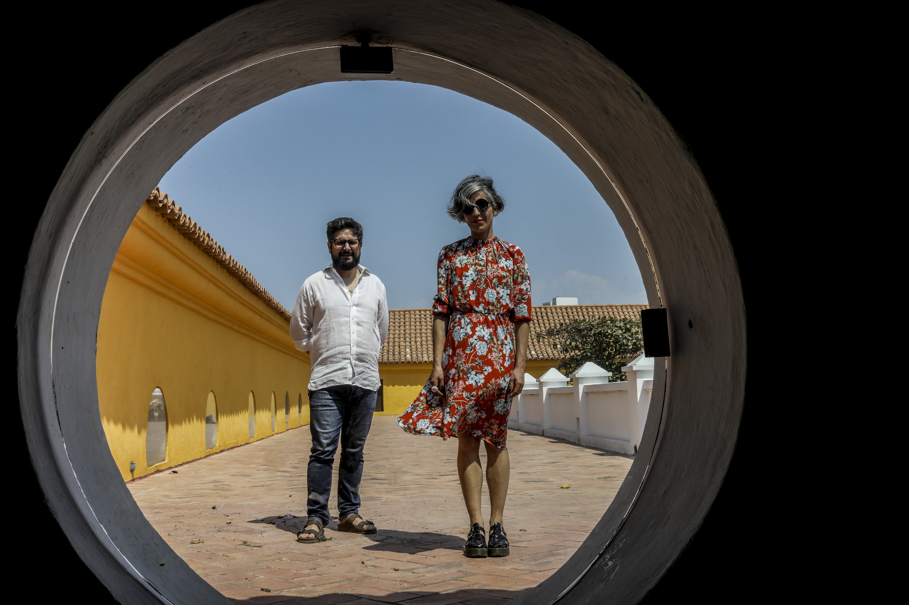
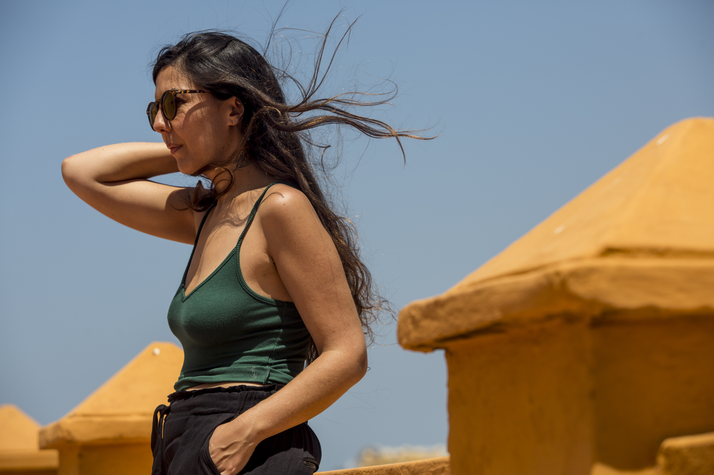

*Translated from the original published in Spanish in [El Espectador](https://www.elespectador.com/noticias/cultura/cada-vez-nos-vemos-mas-en-el-cine/) on March 2018.* 

*Two productions, different in their narrative style and audiovisual language share the portraying of intimate, honest and real stories.*

**Matar a Jesús** by Laura Mora takes to the big screen a sadly common story in Colombia: a man assassinated by an anonymous hit man and a daughter that struggles with the feelings of revenge that grow in her because of the tragedy. On the other hand, **Virus Tropical**, an animated feature directed by Santiago Caicedo and inspired by the homonymous comic by illustrator Powerpaola, shows the weird, awkward and painful passage from childhood to adolescence.

This was a tendency present in a good portion of the programming of the 58th Cartagena International Film Festival –FICCI, in which both productions took part and the first one earned the Audience Award. This is also a narrative style that is making its appearance in cinematographic production at an international level.

We seem to be witnessing the end of the charm of watching movies that happen in a world far from ours and spectators are now choosing stories in which they’re able to find themselves. It seems like the public is leaning more towards stories that, when projected in those spaces that give us the possibility of traveling to other universes and we call movie theatres, make them feel part of the world portrayed in the big screen and less alone in the experience of being alive.

In **Matar a Jesús** the quotidian realism of the story can be seen and heard from the very first moment. Two young actors with strong ‘paisa’ accents, that use words and unique expressions from this region and end every third or fourth phrase with an “*ome gonorrea*”, make us know that we are in front of persons that inhabit our country and share the same narrative of growing up in this complex reality.

Laura Mora decided to employ natural actors, who in their own lives had lived situations close to those that the fiction is inviting them to portray, which fills the interpretations with special strength and realism. The lead character, Lita, recognizes in the street the eyes of the man who shot her father. He’s a young man with a turbulent past that lives his life in a constant balancing game with death.

His name is Jesús, a choice that the director makes to establish one of the biggest paradoxes in Colombian society, in which a profound religious faith is profess at church in juxtaposition to a constant and daily state of violence. Throughout the production, the audience is able to see how Lita debates between the revenge feelings that her father’s assassination awakens, and the normality that Jesús’ life reflects.

As Lita’s university friends do, Jesús likes to drink ‘chorro’ (Colombian slang for aguardiente, a typical liquor), smoke pot and dance when his team, the Deportivo Independiente Medellín – DIM -, wins. Sharing the daily life of Jesús and finding kindness in him shows Lita the contrasts of Colombian violence, in which evilness is not total in every case, and some of the bad guys have nuances.

On the other hand, **Virus Tropical** takes us to an animated 2D black & white world. We find ourselves immerse in the life story of Paola, a girl that was born in Ecuador and then transferred to Cali, Colombia. We see her constantly drawing: when she sits at the table with her mother and her sister that are laughing sometimes, other fighting and other crying; and also as a escaping from the mockery of her classmates in Cali, who make fun of her weird Ecuadorian accent and the length of her skirt, way long for their taste.

Her classmates, her neighbours and her family are the companions of this story about first times: the first kiss, the first time falling in love, the first breakup, the first time having sex. A story about the awkwardness of growing up that is common to everybody.

The strokes of illustrator Powerpaola are as important as the situations that the characters go through, both in the comic and the movie inspired by it. Like her character, Paola was born in Ecuador and then nationalized in Colombia. Her strokes, combined with Santiago Caicedo’s direction and Enrique Lozano’s script, where cause of applause and admiration from national and international spectators in both FICCI and Berlinale, in which the movie had its international premiere.

No formula or strategy was used in order to create this connection with the audience. For Paola, her only focus was exorcising her own life story in order to let it go. And Caicedo, whom is a close and old friend of hers and witnessed the moments portrayed on fiction as they were happening, proposed to the illustrator the making of the movie.

The desire of liberating from constant thoughts that turn heavy and difficult is common for both Laura Mora and Powerpaola in their films. **Matar a Jesús**, a love letter for someone that isn’t alive anymore, is written with cinematographic language and thanks to this, a catharsis is made. And in **Virus Tropical**, Powerpaola finds the way to spark her inspiration: getting her head and life rid of things that haunt her.

\*\**

A selection of other movies that were part of FICCI’s programming reaffirms the tendency for intimate and real stories: **Muchos hijos, un mono y un castillo** by Gustavo Salmerón, a documentary in which the director makes a comical portrait of his mother, who seems to have fulfilled all of her life’s dreams of having a lot of children, monkeys and a castle, but now is threatened by economic crisis; **The Smiling Lombana** by Daniela Abad, an investigation that the filmmaker makes about her enigmatic grandparent, father of her mother; a man as attractive as he was talented and that went from being a prolific sculpture maker to an interior decorator specialized in tendencies of ‘traquetos’ (common denomination for those who earn money illegally) and ended up being one of the first Colombian drug lords, and **Verano 1993**, movie in which we assist the first vacations of a recently adopted child with her foster family, and that is based in the life of director Carla Simón. These are only some examples.

Additionally, we are in a moment in which films like **Ladybird**, catalogued as a semi autobiographic movie of director Greta Gerwig, and **Boyhood** by Richard Linklater, that takes the audience through the actual passage of time in the life of a character while we accompany him and his family, are getting awards and nominations from top cinematographic events.

We seem to be assisting the triumph of the intimate and faithful portrait of reality in opposition to “misery porn”, that was well defined in the 70’s by the members of the Group of Cali, Carlos Mayolo and Luis Ospina. They said that this cinematographic narrative style leaned towards the exploitation of poverty until it was turned into merchandise and raw material for productions that sold well, especially in foreign countries, which transformed misery into a rentable show.

Now we aren’t attending the exploitation of tragedies and well-known troubles of Colombian society in movies. In this moment the spotlight is in stories that make us feel portrayed in the screen without the necessity of showing the lowest and saddest parts of our reality. Showing life itself is enough.

Lucrecia Martel perfectly explained this tendency during her talk in the academic segment of the Festival. “*We’ve never been witnesses to so many seconds of humanity*” she said, referring to how nowadays cellphones and cameras allow the possibility of narrating our own lives and digitally preserving moments. The pictures and stories that we upload to Instagram and Facebook become the tale that we built of ourselves and our lives and that we decide to show to the world saying: this is me. For her, cinema should increasingly follow the path of using this kind of material.

A similar conclusion came from Owen Wilson’s talk in Cartagena, when he explained that he puts as much of himself as he can in every character. His acting formula for bringing up laughter and entertaining the audience is being as faithful to reality as he can, since reality is awkward enough and brings by itself the humour a character and a movie need. Therefore, is not strange that the audience finds that Owen Wilson is not different from his characters in his personal life, as he himself declared.

\*\**

In **Matar a Jesús** and **Virus Tropical** we see familiar scenes that are effectively taken to the screen. About this, Powerpaola states “*my life is not mine*” and with this she does a good summary of the tendency for intimate and real stories. As she establishes, we are living in a world that has common problems and concerns for those who live in it, no matter the territory, turning her own life in everyone else’s life.

The embrace and the warmth we feel by seeing our own stories reflected in the big screen seems to be the feeling that the public is demanding nowadays. Paola says that she has an antenna that she’s constantly waving in the crowd, so she can have some sort of guidance between all the existing tales. She needs it in order to really listen to herself and identify the story that she needs to exorcize and that the public will relate to. This way, her life is a vehicle for talking about all of our lives.

Lucrecia Martel’s words resound on her, expressing that she’s never had an expository conversation like: “*Marco Antonio, I love you, let’s kiss*”, as we often see in movies. For her, cinema is moving in a direction that seeks to end this kind of unrealities. A cinema that aims to show the misunderstandings in everyday conversations, the awkwardness of sex, the ugliness in kissing and so forth. Martel justifies this tendency with the affirmation that there’s nothing more interesting and unexpected than life itself and that the best raw material for creativity is waiting just outside, in the city’s streets and parks.

On the other hand, Laura Mora fills her production with brutal honesty; by declaring it as a way of letting go of the weight of sorrow that lived with her because of her father’s assassination, which happened 16 years ago. In Cartagena she stated that she wanted her movie to express the violence and beauty that are so naturally present in Colombian reality. She said something risky: “*I won’t ever forgive my father’s killers, but I will never be violent. I resist violence and with that, I end its cycle”*. Declaring her right of not forgiving but doing no harm gives her movie a new load of sense and reality, and this violence cycle ending is present in Lita’s story in the movie as well.

Paola’s antenna for detecting stories is perfectly pointed and working. Laura seems to be connected to it and the audience is receiving the message and applauding it. We go to the movie theatres; the lights go out and the big screen lights up. We are ready to see ourselves in this filmmakers’ tales, which are also ours.

\*\**This written piece was produced during the 2018 Gabriel García Márquez Fellowship on Cultural Journalism, organized by the FNPI with the support of the Colombian Ministry of Culture and The Cartago Foundation.*