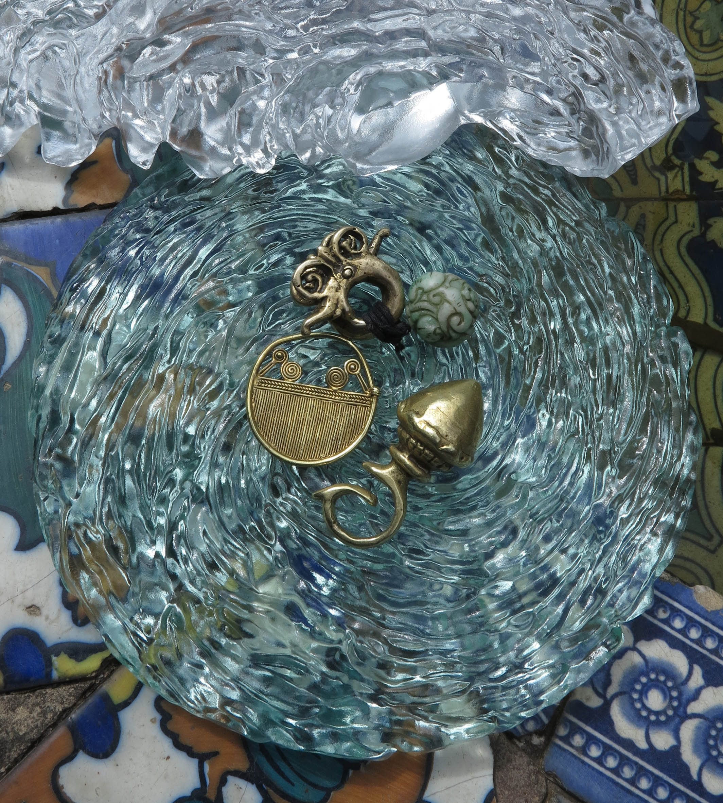

*Translated from the original published in Spanish in [El Espectador ](https://www.elespectador.com/noticias/cultura/pablo-posada-pernikoffcada-ser-humano-se-relaciona-con-la-materia/)**on September 2017.* 

Talking with Pablo Posada Pernikoff is getting in touch with the wisdom and knowledge that come with many years of studies and travels, which have given this man an unique vision of the world that he carries with himself and is translated into his artwork and his words.

Pablo has studied engineering, mathematics, industrial design and arts and at the same time these studies have taken him to live in Colombia, Canada, Italy and Japan. In this last country he lived for more than two decades until, five years ago, he sold his apartment, packed his belongings in boxes and started traveling and exposing his artwork around the world. In this process, he adopted as his own his friends’ houses who received him in every destination, making him feel like arriving to a new home each time.

As he expresses it, his closeness to mathematics and physics gave him a sixth sense that make him fascinated by nature and the way all of its elements work internally, causing phenomena that are not usually perceptible to the human eye, but that in time transform the environment that surrounds us. The natural ageing of materials such as tree’s wood, road’s cement, the rust on iron gates and the moss that grows in-between stones are Pablo’s passions. But his focus isn’t in showing the consequences of time in a final product but, on the contrary, in making time itself evident by capturing the present moment, in which numerous forces are acting on every element present on earth, irrevocably changing them by showing their past and starting to insinuate what would be their future.

It’s a wonderful mixture between science and the spirit of nature that seduces Pablo. He has found a way to appreciate it closely by sharing with indigenous communities in the Colombian Amazon and the Borneo Island in Asia, learning to admire and envy their profound and close connection with earth.

The interest that goes through Pablo’s art pieces is the same: making tangible and visible the constant and infinite movements of nature forces on every material. But beyond a theory that he’s passionate with and that makes talking to him a trip to new perspectives from where to observe the world, what he seeks with his art is to move fibers in his audience.

His pieces are evidence of the traces of time, the capture of an instant with all that implies through materials such as glass, paper, gold and coffee; and techniques like glass manipulation and engraving. Each one aims to arise a feeling in the spectator: excitement, exaltation or calm; making evident another one of Pablo’s beliefs in his life and work: that each human being relates with matter in an emotional way that goes beyond an utilitarian relationship.

That’s why we have objects that we refuse to get rid of despite of them being old and worn out, because they’re in our lives for more than being useful. In Pablo’s case, his favourite objects that profoundly speak to his soul are four earrings and two rings that he carries along with him in his belt and his scarf, and that are a reminder of lots of visited places and cultures that taught him invaluable lessons. These objects have turned into a sort of mobile home for this nomad.

Likewise, Pablo believes that between humans and objects a unique language is established. That’s why he doesn’t commission more than structures and holders, and his own hands do the manipulation of all the actual pieces. For him, it is essential to be able to feel the materials and establish a connection with them, that is what determines how the piece is going to look in the end. His strokes don’t come out of a predetermined and strict plan but are spontaneous, a result of the artist hearing what the materials have to say to him and letting his hand be guided by these messages. This way of working emulates how his life has developed.

His journeys have taken him to adopt different work spaces, preferring always craft masters spaces above artistic workshops, since those who work directly with materials help him step aside from artistic guidelines and the necessity of putting art in a pedestal, and allow him a realer and more sincere connection with raw materials. In Bogotá , for example, he works in the workshop of an artisan devoted to glass who knows nothing of art but everything about this material. The connection with people, which is accomplished through sharing a coffee, a beer or a glass of wine with a good conversation, is also an enormous fountain of knowledge and inspiration for the artist.

“Luz Manantial”, the exposition he opens next Thursday, September 28th in the ‘Mercedes Sierra de Pérez ‘El Chicó’ Museum in Bogotá, is his return to exposing in a national museum after five years and it reunites around 60 pieces that he developed in the past five years. For Posada, the house in which this Museum is installed is the ideal place for the exposition because its materials speak eloquently to him. Every crack from the wood, the ageing in the stones and the nature that surrounds the place say a lot about the passage of years and all the stories that have taken place here. The physical space creates a connection with the art pieces and Pablo’s motivations and hopes. Additionally, being a non-commercial place is coherent with what, for him, should be the objective of every artist: creating culture and giving aesthetic pleasure to the audience.

The assembling and the way the public is going to enjoy this exposition throughout November 16th becomes a new work of art that Pablo is making with a small work team in which, again, planning is overlooked in favour of the natural flow of things. Therefore, the exposition has been designed taking into account the Museum’s space generosity and the way in which every room has communicated with the artist about how to use it, looking always for the symbiosis between the space and the pieces in order to bring emotions to the public.

Regarding his new exposition, the artist declares he doesn’t like titling his work because of the risk of giving suggestions to the public. Therefore, the title ‘Luz Manantial’ (Light from the source) was perfect, because it sounds like something ethereal and gives the public the necessary space to be the last assembling piece in this artwork with their observations and perceptions.

Just like this article, that could pretend to be a long-form piece, maybe an artistic review or just a commentary about how nice it is to share a coffee and a conversation with this artist, but its finally an invitation for you to enter the unique vision of Pablo Posada Pernikoff and let yourself be marvelled, like him, by the infinite and unlimited movements of nature. Visit ‘Luz Manantial’ from September 28th throughout November 16th in the Chicó Museum of Bogotá (Carrera 7 # 93 – 01) so you can make your own conclusions about his art pieces, in which the moment and all its possibilities are encapsulated.