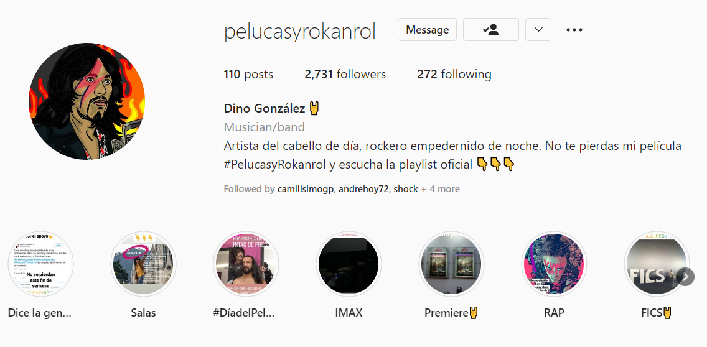

'Pelucas y Rokanrol' is the debut film of Colombian renowned actor and musician, Mario Duarte. Mario provided me with pictures, videos, and his ideas behind the film and I translated them into a digital campaign mostly focused on Instagram for promoting the film. 

We created an Instagram profile for Dino Gonzáles, the fictional character protagonist of the movie. Dino is an old-school rocker and hairdresser, that loves playing gigs with his band, the 'Chapinero Mutantes', and has a way of always getting into trouble. The idea of the profile was to bring Dino to life, showing memorabilia of his days as a rocker in Bogotá and different testimonies from people in the scene talking about his excentric character. 

The captions, the bio, the images, and videos Dino 'decided' to upload, as well as the way he interacted with his followers all followed the language and style created for him, which was the branding for the communication of the movie. It is remarkable that the growth we had on Instagram (which has reduced a bit over the years) was completely organic and we gain followers thanks to word of mouth of the people, the engaging characteristic of our profile, and the fans that Mario has in the Colombian audience. 

We uploaded memes, behind-the-scenes pictures, and videos with the soundtrack of the movie, which included many well-known Colombian bands. Likewise, we included posts with the memorabilia that brought Dino to life, like posters from his previous gigs and the picture of the cassette of his debut album, among others. All this was mixed with actual information about the screenings of the movie and its festival tour. 

'Pelucas y Rokanrol' had around 11k spectators, which is a huge success considering is an independent movie and that the majority of the promotion was solely done through Dino's Instagram profile.