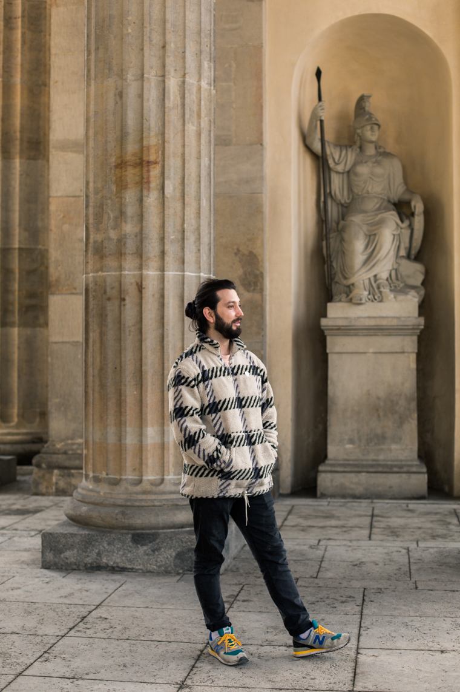

La primera vez que hablé con Francisco, ese no era su nombre. Me dieron su contacto como «Chino» y me dijeron que era la persona para hablar si quería saber sobre la participación de los chilenos en Berlín en apoyo al estallido social que se dio en Chile en octubre de 2019. Luego supe su verdadero nombre y que su apodo se debía a unos rasgos físicos que para mí no resultan tan evidentes. También, sobre todo, que alberga una creencia profunda en la política.

Francisco Álvarez (Puerto Montt, Chile, 1988) nació y se crio en una familia en la que se hablaba y se participaba en política. «Yo recuerdo que en mi casa, de niño, se nos incluía en las discusiones políticas de la familia. Mis papás se preocuparon por que mi hermano y yo tuviéramos posición política y compromiso.» Su hermano mayor eligió la militancia y Francisco siguió el ejemplo. 

A mí, viniendo de Colombia y con apenas catro años menos que él, el verbo militar me suena a policías, uniformes o guerras. Para Francisco, en cambio, la política es la herramienta transformadora de la sociedad y esa convicción personal se traduce en participación. Ya desde su época como estudiante de Sociología de la Universidad Católica de Chile era parte de grupos y se la pasaba en el patio organizando marchas y debates con los compañeros. «Yo accionaba en espacios sociales en el día a día —explica—. La experiencia de militar tiene que ver mucho con tomar decisiones en colectivo, tiene poco de individualista.»

Hoy forma parte del Frente Amplio, colectivo político y social de izquierda que busca dar espacio de representación en la política chilena a partidos y ciudadanos diversos más allá del bipartidismo, y milita en Convergencia Social, formación del Frente Amplio que solo recientemente, en marzo de 2020, logró el estatus de partido político. Convergencia Social es un partido de izquierda con bases rabiosamente contemporáneas. Junto a sus principios socialistas y democráticos se elevan la aspiración a una sociedad «libertaria y feminista». Si bien tres de sus cuatro diputados son hombres, los cargos principales del partido están en la actualidad en manos de cuatro mujeres. Hay más: junto a los frentes de Salud, Estudiantes, Trabajo y Feminismo, se erige el Frente de Diversidades y Disidencias Sexuales y de Géneros.

Ahora que vive en Berlín, mientras hace un master de Sociología y Estudios Europeos en la Freie Universität, Francisco participa de las actividades del partido en buena medida a través de reuniones virtuales por Zoom. Tal vez como una clase de premonición o simplemente una triste coincidencia, los miembros de Convergencia Social y él ya conocían lo que era tener la oportunidad de verse y trabajar únicamente a través de las pantallas de un computador, a causa simplemente de la distancia. Aún así, Francisco se encontraba con los otros tres miembros de Convergencia Social que viven en Berlín y ese espacio ha sido otro de los muchos interrumpidos por la pandemia del Covid-19.

Por fuera de Chile, el frente internacional de Convergencia Social está conformado por setenta personas, de las cuales unas veinte participan activamente. «Como militantes de Convergencia participamos de instancias de redes de inmigrantes chilenos en el mundo y también nos concentramos en crear relaciones políticas con partidos de izquierda en donde uno vive, por ejemplo Die Linke acá, en Alemania.» En las reuniones que se realizan cada dos semanas o semanalmente, si se da la necesidad, se pueden encontrar los mismos siete o diez cuadraditos de Zoom que corresponden a personas que viven en España, Francia, Alemania, Inglaterra e Italia. En estas reuniones se discute sobre vías para mejorar la vida de los inmigrantes chilenos en el exterior. En la primera conversación que tuvimos, Francisco estaba trabajando para que aprobaran un proyecto de ley con el cual los chilenos en el exterior pudieran votar en las elecciones de su país. En la última me dijo «Eso lo perdimos».

**LA POLÍTICA COMO ESFERA DE DECISIÓN**

La primera vez que Francisco se fue de su país fue en un viaje de un año que hizo con los ahorros de su primer trabajo como sociólogo graduado. Por entonces buscaba «abrir mis perspectivas y viajar solo». Recorrió Estados Unidos, Canadá, Asia, varios países de Europa del Este, Italia, Francia y Alemania. Cuando pasó por esta última, pensó «Berlín está rebueno para vivir. Tiene buenas escuelas de sociología y ciencias sociales y es la capital política de Europa, importante en estos momentos de crisis del proyecto liberal de globalización y la democracia en general». Volvió a Chile pero solo de manera temporal, mientras trabajaba y ahorraba de nuevo antes de emprender el viaje que lo llevaría a cambiar de hogar.

Llegó a Berlín en el verano de 2018. Durante el primer año trabajó en un hostal, estudió alemán, hizo fiestas en la Tecno-Späti de Leinenstrasse, como él la llama, y jugó al fútbol con el Pichanga Fútbol Club, que se se reunía todos los miércoles al mediodía en Sonnenallee y hacía un tercer tiempo que con facilidad duraba hasta el jueves. La primera cuarentena la pasó en una finca de Brandenburgo, en las afueras de Berlín, trabajando como recolector de espárragos con dos amigos y dos amigas. Está claro para él: «Nunca quise que el hecho de militar redujera mi identidad a solo ese aspecto de mi vida. Es muy relevante pero no es el único».

Sin embargo, su interés por la política se parece mucho a una pasión y está presente en los temas que elige, los análisis que hace de los fenómenos contemporáneos, el lenguaje específico con el que me explica lo que está sucediendo en Chile e inclusive en la lectura que hace de su experiencia berlinesa: «Los grandes conceptos que dieron estabilidad a la integración del mundo global hoy en día están en crisis. En Chile somos el patio trasero. Quería salir un poco de la periferia y venir al centro a ver qué estaba pasando. Son cosas que en Chile no podría haber visto o aprendido de primera mano».

¿Qué es la política para ti?, pregunto. «La política es la esfera que hemos dotado para decidir cómo se vive en lo público y lo privado; define el marco de lo posible en la esfera privada, aunque el acento está en lo público. Yo entiendo la política como una actividad que tiene que ver con el poder de hacer algo, no solo con el poder desde la fuerza, sino con el qué se puede hacer o no en la vía pública, qué se puede hacer o no en tu vida privada.» Esa visión que se remonta al feminismo de los años setenta y, antes aún, a las luchas raciales en Estados Unidos y es hoy el reclamo urgente de tantas sociedades: «Lo privado también es político. En el fondo lo que tú puedas hacer en tu vida privada, cómo te relaciones con tu hijo, con tus hermanos, con tu pareja… Todo es político».

«El mundo político y la prensa de Alemania se empezaron a preguntar ¿por qué se juntan quinientos chilenos en la puerta de Brandenburgo?»

Su creencia choca con la desesperanza que siento al ver la ineficacia política de mi propio país, encarnada en el actual gobierno, que lo único que genera en el panorama latinoamericano son memes. Al parecer, lo que me falta es paciencia y es bastante común: «Lograr hacer un cambio efectivo para los pueblos toma muchos años. Ahí es donde uno requiere mucha convicción y donde vienen las dificultades. He conocido mucha gente militando, claro, haciéndolo \[como lo hago] desde los catorce años, pero de esos son muy pocos los que siguen hoy día. Hay mucha gente que va y vuelve, se desencantan, pasan años y luego vuelven de viejos. La gente que milita es un pequeño porcentaje porque es difícil, no te pagan, demanda mucho y a veces son más los momentos ingratos que los beneficios».

Estos momentos ingratos son las luchas perdidas, como el intento de conseguir el voto de los chilenos en el exterior. Es hasta ahora que se está viendo resultados positivos en su militancia. «La revuelta de octubre de 2019 empuja finalmente al plebiscito. Es la primera vez que definimos un pacto social distinto como producto de la participación política.»

En el plebiscito también se aprobó la elección de una convención constituyente que redactará la nueva Carta Magna. Es decir, que la labor quedará en manos de un grupo de ciudadanos elegidos por votación popular el próximo 11 de abril de 2021, 155 convencionales constituyentes. La nueva constitución también será sometida a votación popular, un plebiscito previsto para mediados de 2022 por el que será aprobada o rechazada.

«Estoy satisfecho pero no contento. En política nunca está todo dicho. En el partido no creemos que el proceso constituyente y la redacción de una nueva constitución vaya a ser el cierre completo de todo esto.» Francisco ve el futuro con una mezcla de esperanza e incertidumbre y también prevé «mucho conflicto, porque sigue faltando representatividad, como por ejemplo, de los pueblos indígenas». Además, es consciente de que redactar la constitución es un primer paso, uno grande e importante, pero que debe ir unido a una transformación cultural. «Valóricamente la forma de pensar de las personas está fuertemente marcada por un individualismo muy exacerbado. La constitución aporta un modelo no neoliberal, pero en términos de valores, es un proceso más largo. No vamos a cambiar la sociedad chilena por un esfuerzo formal simplemente, es mucho más que eso.»

**SABER QUE NO CONTROLAS TODO**

Conversando con Francisco llegamos a puntos en común de nuestras experiencias como migrantes latinos. No logro señalar con exactitud el quiebre en el cual su creencia en la política se separa tanto de la mía y de la que percibo en las personas de mi generación, en la que las iniciativas sociales autogestionadas, el escepticismo hacia la política o una triste resignación que se pasa con humor negro, son más comunes que la militancia.

Él vuelve a recalcar lo cercana que va la política con su personalidad: «Soy relajado, me tomo mi tiempo y tengo pocos arranques. Si las cosas no resultan a la primera, espero. Eso me ha servido en política porque la ansiedad juega en tu contra». La militancia es un proceso bilateral en su vida, que se alimenta de su personalidad y a la vez la provee con herramientas para continuar en ella. «Quizá la política me formó eso mismo, que tú sabes que estás haciendo las cosas bien pero sabes que no vas a conseguir resultados en un año. Desde los catorce años, todos los problemas que yo veía en Chile y por todo lo que trabajé toma sentido en un momento como este, que se da dieciséis años después.»

Recuerdo que me explicó que la militancia es una tarea ingrata que, por tanto, pocos eligen y encuentro algo de belleza en la manera en que Francisco la integra a su vida: «En política te vuelves loco si quieres controlar todo, porque simplemente no controlas todas las variables. Eso me ha enseñado la militancia, que para las cosas buenas hay que esperar».