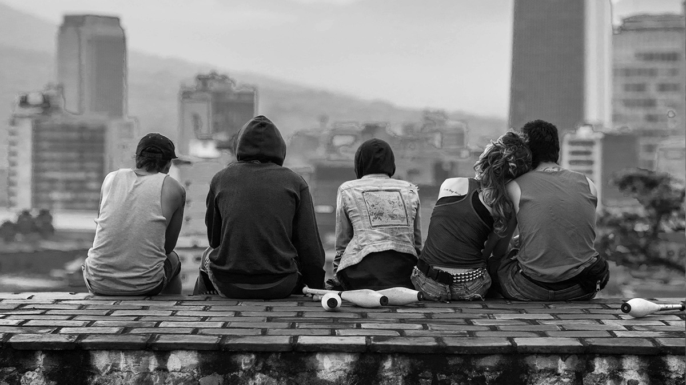
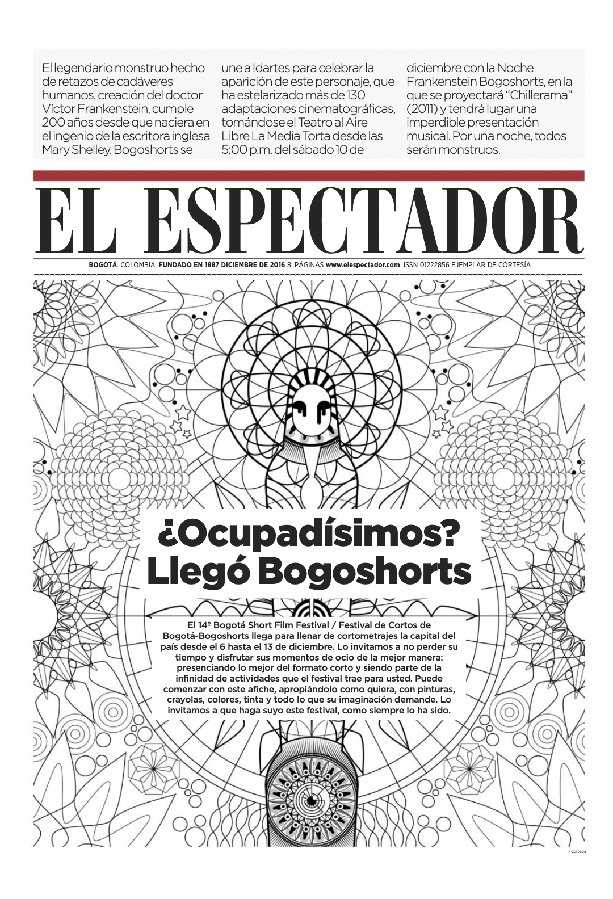
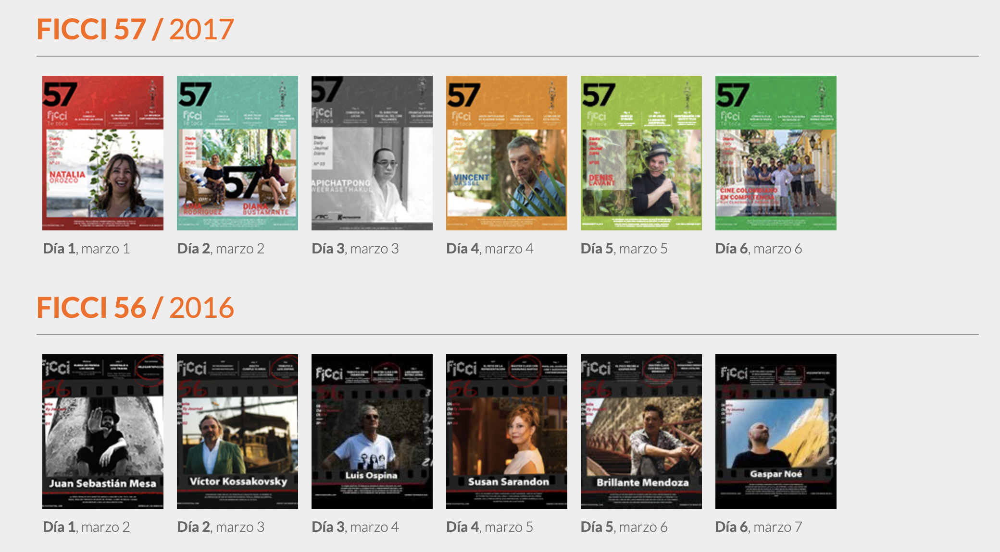

I worked as content creator and coordinator for an agency that promoted movies and movie festivals. I had the opportunity of creating many different kinds of content: press releases, press kits, newspaper offsets, captions and radio content. Here are some that are still available on internet. 

1. A press release for The Nobodies (Los Nadie) debut film of Colombian director Juan Sebastián Mesa. The movie is about a group of punk-rebellious-youngsters living in Medellín. They love, they party and they grow in the streets of the city. The language of all the press content reflected the spirit and vibe of the movie. You can read one of the press releases [here](http://www.lbv.co/velvet_voice/losnadie/com006_losnadie_punk.html) (in Spanish). 

2. Offsets of El Espectador: El Espectador, one of the oldest and more widely read newspaper in Colombia, alongside with the agency I worked for, created special offsets for these events. I coordinated, edited and created most of the content of them. You can read one [here](https://issuu.com/ficcifestival/docs/ficci57_elespectador), made for the 57th Cartagena International Movie Festival -FICCI-, and another [here](https://issuu.com/movimientobogoshorts/docs/elespectador_14bsff) for the 14th edition of the Bogotá Short Film Festival/Festival de Cortos de Bogotá - BOGOSHORTS. (in Spanish) 

3. FICCI Journal: for the 56th and 57th edition of the Cartagena International Film Festival - FICCI - I was in charge of coordinating, editing and creating content for the FICCI journal, a daily newspaper containing news and important information about the festival. [Here](http://ficcifestival.com/diarios/58bbac18efde6__ficci57_DIARIO_05-03-2017.pdf) you can read one of my favourite editions (in Spanish).